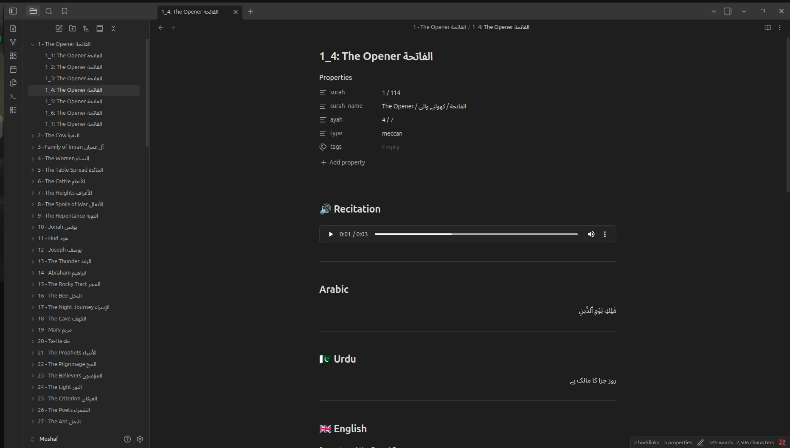

# Quran Markdown Script

The purpose of this script is to be able to study the Quran in a structured way, making it easier to navigate through the verses. Study in multiple languages, understand it with differnt tafseers, make connections in verses and take notes.   

This script generates Markdown files for each Quran verse (ayah) with comprehensive multilingual content and connections for use in Obsidian vaults.


## Features
- Generates individual Markdown files for each ayah with:
  - Arabic text
  - English translation
  - Urdu translation
  - Urdu tafsir (exegesis)
  - Audio embedding (MP3)
  - Navigation links (previous/next ayah)
  - Chapter information
- Organizes files by surah and ayah
- Handles Bismillah insertion for appropriate surahs
- Supports both internal vault audio linking and external audio paths

## Requirements

- Python 3.x
- Required JSON data files in `data/` directory:
  - `quran.json` - Quran text
  - `en.json` - English translations
  - `ur.json` - Urdu translations
  - `chapters/ur.json` - Urdu chapter information
  - `chapters/en.json` - English chapter information
  - `ur-tazkirul-quran/` - Urdu tafsir files (per surah/ayah)
  - `audio/` - Audio files organized by surah/ayah

## Usage

1. Place this script in your project directory
2. Ensure all required data files are in the `data/` folder
3. Run the script:
   ```bash
   python QuranImportScript.py
   ```
4. Generated files will be placed in the `../Mushaf` directory

## File Structure

Generated files are organized by surah number and chapter name:
```
../Mushaf/
└── 001 - Al-Fatiha Al-Fatiha/
    └── 001_001: Al-Fatiha Al-Fatiha.md
```

## Integration with Obsidian

The generated Markdown files are designed to be read and annotated using **Obsidian** software. Once imported into an Obsidian vault, you can:
- Read and study each ayah with all translations and tafsir
- Make personal notes and reflections within each file
- Create connections between related ayahs and concepts
- Use Obsidian's linking system to navigate between related content
- Utilize the audio embedding feature for recitation practice
- Take advantage of Obsidian's tagging and search capabilities

## Configuration

The script includes configurable options at the top:
- `AUDIO_BASE_PATH`: Path to audio files
- `USE_EXTERNAL_LINK`: Whether to use external audio links
- `AUDIO_EXT`: Audio file extension

## Output Format

Each Markdown file includes:
- YAML frontmatter with surah/ayah metadata
- Audio embedding section
- Arabic text
- English translation
- Urdu translation
- Urdu tafsir
- Navigation links
- Tafsir notes and personal reflection sections